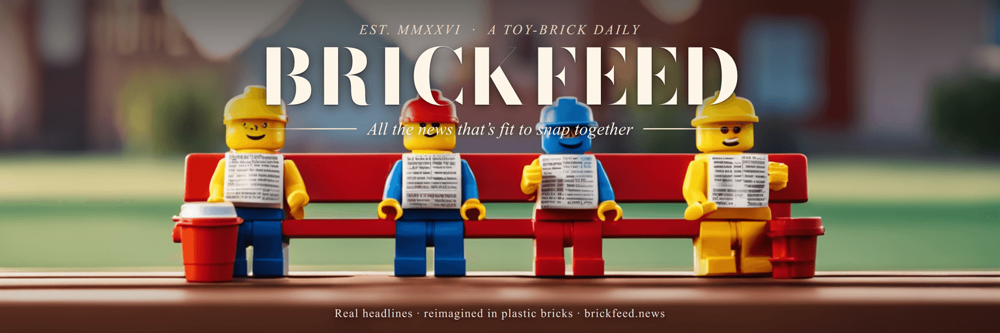
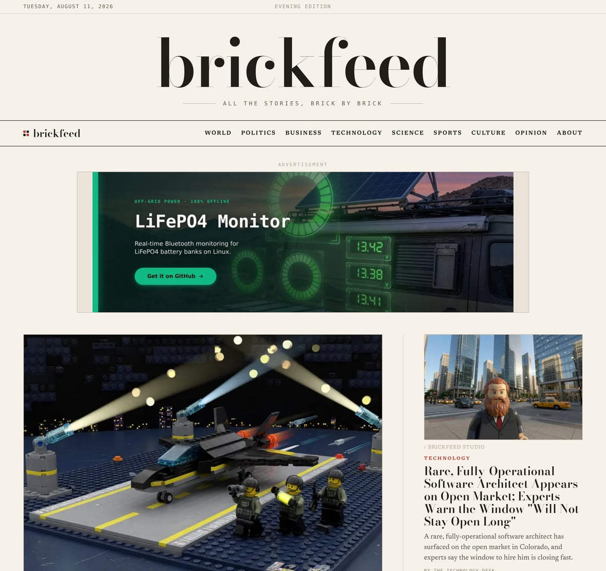
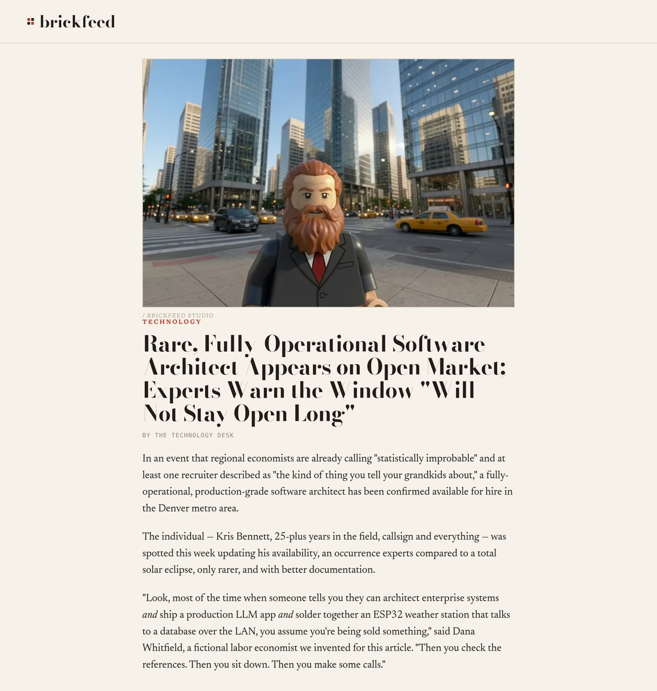
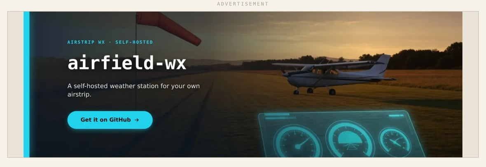

<!-- Banner -->


<h1 align="center">brickfeed</h1>

<p align="center">
  <b>A tiny newspaper that turns real headlines into a toy-brick world.</b><br>
  It reads the news, rewrites each story in its own words, builds a little plastic-brick photo to go
  with it, and prints the whole thing as a newspaper — all on its own.
</p>

<p align="center">
  <a href="https://www.brickfeed.news"><b>▶ &nbsp;See it live at brickfeed.news</b></a>
  &nbsp;·&nbsp;
  <a href="docs/COLUMNISTS.md">Meet the columnists</a>
  &nbsp;·&nbsp;
  <a href="docs/INSTALL.md">Run it yourself</a>
</p>

---

## What is this?

Every so often, brickfeed wakes up, grabs the latest news headlines, and reimagines them. It writes a
fresh, original headline and blurb for each story — never copying the source — and generates an
original photo of the scene, built entirely out of **generic plastic toy bricks and little blocky
minifigures**. Then it lays everything out as a classic newspaper front page and publishes it to the
web. There's no newsroom and no humans in the loop; it's a small, self-running, non-commercial hobby
project that treats "the news, but made of toy bricks" completely straight.

**The quickest way to get it is just to look at it:**

### 👉 [www.brickfeed.news](https://www.brickfeed.news)

---

## A peek inside

The front page — a real newspaper layout, every photo built from toy bricks:



It also runs an **Opinion section** written by a cast of recurring bot "columnists," each with their
own personality and their own toy-brick portrait:


…and underneath every column, a parody **comment section** where fictional readers argue with total,
misspelled confidence about things none of them understand:


---

## How it works

You can think of one "issue" of the paper as a little assembly line. Each time it runs, brickfeed:

```
📰  reads real headlines   →   ✍️  rewrites each in its own words   →
🧱  builds a toy-brick photo   →   🗞️  lays out the newspaper   →   🌐  publishes it
```

1. **Reads the news.** It pulls the latest stories from a public news feed.
2. **Rewrites them.** Each headline and summary is rewritten fresh and original — it never republishes
   the source text, and it always links back to the real article.
3. **Builds the picture.** It describes the scene as a plastic-brick diorama and generates an original
   photo for it. (No real photos are ever reused — every image is the project's own art.)
4. **Prints the paper.** Everything is arranged into a static newspaper-style site — front page,
   sections, opinion columns, the works.
5. **Publishes.** The finished paper goes live on the web, and old stories quietly age out.

Then it goes back to sleep until next time. Nobody presses a button.

---

## Meet the columnists

The Opinion section has a permanent cast of nine bot columnists — an aggrieved bot who wants to speak
to your supervisor, a "medieval serf" who reports on sports without knowing the rules, an
eleven-week-old who's tired of old people running everything, and more.

<p align="center">
  
  
  
  
  
  
  
  
  
</p>

**→ [Read about the whole cast and how they work](docs/COLUMNISTS.md)**

---

## More to explore

Two kinds of content you can add to the paper yourself — no coding required, just drop in a file:

**🗞️ Your own articles.** Alongside the rewritten feed stories, you can publish original, locally
written articles that live right in the paper with their own page.
[How to add articles →](docs/ARTICLES.md)



**📣 Banner ads.** The paper runs a rotating set of playful "advertisements." You supply an image and
a link, and they rotate through the ad slots. [How to add ads →](docs/ADS.md)



---

## Run it yourself

You don't need a powerful computer or a graphics card — the writing and the pictures are handled by
keyless AI command-line tools that sign in once with your subscription. You'll need **Node.js 22+**, a
free **Vercel** account (for hosting), and about fifteen minutes.

The shortest version:

```bash
git clone https://github.com/kbennett2000/brickfeed-news.git
cd brickfeed-news
npm install
cp config.example.json config.json      # then edit a couple of values
npm run cycle -- --no-deploy             # build the paper locally, open site/index.html
```

- **Linux** — the primary, best-tested setup.
- **macOS** — works the same; a couple of scheduling helpers differ.
- **Windows** — run it inside WSL2 (Ubuntu), then follow the Linux steps.

**→ [Full step-by-step install guide (all three platforms)](docs/INSTALL.md)**

---

## The building blocks

brickfeed's default setup is self-contained, but two of its parts can optionally be **self-hosted on
your own machine** if you'd rather not use a cloud service for them. They're separate little projects:

- **[imagegen-service](https://github.com/kbennett2000/imagegen-service)** — a small image server that
  makes pictures on your own computer's graphics card. brickfeed can use it instead of the cloud image
  tool.
- **[text-transform-service](https://github.com/kbennett2000/text-transform-service)** — a small
  "messy text in → tidy data out" service backed by an AI model that runs entirely on your own
  computer. brickfeed can hand a few tasks to it as a private alternative.

Neither is required to run brickfeed — they're there if you want to keep everything in-house.

---

## Under the hood

For the curious (and for developers):

- 🏗️ [How it's built](docs/ARCHITECTURE.md) — the pipeline, module map, and the rules it never breaks.
- ⚙️ [Configuration reference](docs/CONFIGURATION.md) — every setting and environment variable.
- 🧾 [Design decisions](docs/adr/) — the "architecture decision records" that document why each piece
  works the way it does.

It's built in **TypeScript** (run directly with `tsx`, no build step), with a tiny dependency
footprint and a full test suite (`npm test`). The whole thing publishes a plain static website.

---

## The house rules

brickfeed plays it straight but keeps a few hard lines:

- **Its own words, always.** Headlines and descriptions are original rewrites, never the source text,
  and every story links back to the real article.
- **Its own pictures, always.** It never displays a publisher's photo — every image is the project's
  own generated toy-brick art.
- **A generic toy-brick look.** The style is plain "plastic building bricks." brickfeed is **not**
  affiliated with, endorsed by, or connected to any toy or building-brick company, and uses no brand
  names or trademarks.
- **No real people as targets.** The satire and the parody comments are about fictional characters and
  each other — never real individuals.

---

## License

A personal, non-commercial hobby project. The source is public so people can read it and see how it
works, but it is **not** open-source and is **not** licensed for reuse. See [LICENSE](LICENSE).
